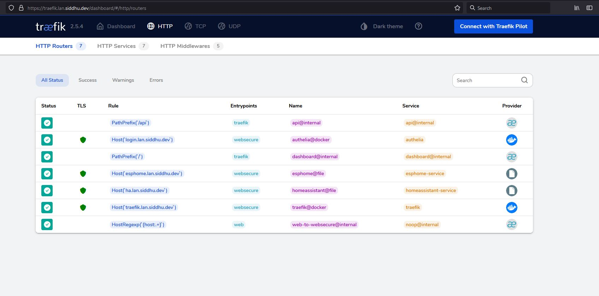
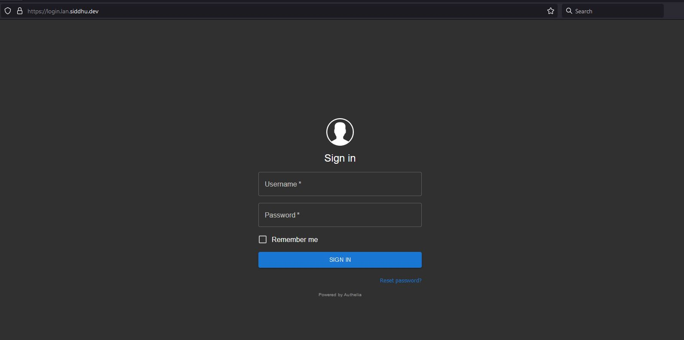
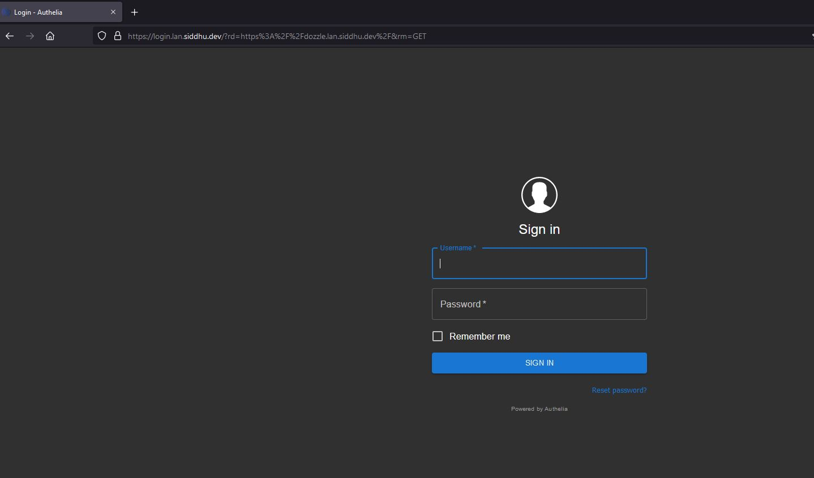

# Authelia Installation

## Prerequisites 

Must have completed [Install Traefik](the-traefik-stack.md)

## What is Authelia

Authelia is an open-source authentication and authorization server protecting modern web applications by collaborating with reverse proxies such as NGINX, Traefik and HAProxy. Consequently, no code is required to protect your apps.


## What does it do?

Enable your users to login once and access everything.

[Authelia Official Website](https://www.authelia.com/)

## Configuration

Authelia configs will be stored at `/mnt/dietpi_userdata/Authelia/config`

Here we are creating 2 middlwares 
 - authelia
 - authelia-basic

`authelia` will be used for normal GUI auth.

`authelia-basic` will use used for http auth (The good old login prompt).

## Installation

`mkdir -p /mnt/dietpi_userdata/Authelia/config`

Create configuration file 

`nano /mnt/dietpi_userdata/Authelia/config/configuration.yml`

You need to change the following secrets. 

 - `jwt_secret`
 - Session `secret`

```
##############################################################################
#          Authelia configuration  sourced from thehomelab.wiki              #
##############################################################################

log:
  level: info
jwt_secret: 2cCBR773wDpe45FPCPmgB # replace this
default_redirection_url: https://login.lan.siddhu.dev
totp:
  issuer: siddhu.dev
  period: 30
  skew: 1

#duo_api:     ## If you want push notifictions of login attempts you can pay for this feature
#  hostname: api-123456789.example.com
#  integration_key: ABCDEF
#  secret_key: yet-another-long-string-of-characters-and-numbers-and-symbols

server:
  ## The address to listen on.
  host: 0.0.0.0

  ## The port to listen on.
  port: 9091

  ## Set the single level path Authelia listens on.
  ## Must be alphanumeric chars and should not contain any slashes.
  path: ""

  ## Buffers usually should be configured to be the same value.
  ## Explanation at https://www.authelia.com/docs/configuration/server.html
  ## Read buffer size adjusts the server's max incoming request size in bytes.
  ## Write buffer size does the same for outgoing responses.
  read_buffer_size: 4096
  write_buffer_size: 4096

  ## Enables the pprof endpoint.
  enable_pprof: false

  ## Enables the expvars endpoint.
  enable_expvars: false

  ## Disables writing the health check vars to /app/.healthcheck.env which makes healthcheck.sh return exit code 0.
  ## This is disabled by default if either /app/.healthcheck.env or /app/healthcheck.sh do not exist.
  disable_healthcheck: false

  ## Authelia by default doesn't accept TLS communication on the server port. This section overrides this behaviour.
  tls:
    ## The path to the DER base64/PEM format private key.
    key: ""

    ## The path to t

authentication_backend:
  disable_reset_password: false
  file:
    path: /config/users_database.yml # Make sure this file exists
    password:
      algorithm: argon2id
      iterations: 1
      salt_length: 16
      parallelism: 8
      memory: 64

access_control:
  default_policy: deny
  rules:
    # Rules applied to everyone
    - domain:
        - "login.lan.siddhu.dev"
      policy: bypass
    - domain: # Proxies only requiring username and password
        - "*.lan.siddhu.dev"
      policy: one_factor
    #      networks:
    #        - 192.168.1.0/24
#    - domain: # Proxies needing 2 factor below
#        - "proxmox.yourdomain.com"
#      policy: two_factor
#      networks:
#         - 192.168.1.0/24

session:
  name: authelia_session
  # This secret can also be set using the env variables AUTHELIA_SESSION_SECRET_FILE
  secret: l2b33jzfzvdvp2esrdhro7n40w # replace this
  expiration: 3600 # 1 hour
  inactivity: 7200 # 2 hours
  domain: siddhu.dev # Needs to be your root domain

  redis:
    host: authelia_redis
    port: 6379
    # This secret can also be set using the env variables AUTHELIA_SESSION_REDIS_PASSWORD_FILE
#    password: authelia

regulation:
  max_retries: 5
  find_time: 2m
  ban_time: 10m

theme: dark # options: dark, light

storage:
  local:
    path: /config/db.sqlite3

notifier:
  filesystem:
    filename: /config/notification.txt
#  smtp:
#    username: <your-user@your-email-domain.org>
#    password: <your-user-email-password-for-smtp>
#    host: <your-email-host-url-or-ip>
#    port: <your-email-port-for-smtp>  # 25 non-ssl, 443 ssl, 587 tls
#    sender: <sender@your-email-domain.org>
#    subject: "[Authelia] {title}"
#    disable_require_tls: false # set to true if your domain uses no tls or ssl only
#    disable_html_emails: false # set to true if you don't want html in your emails
#    tls:
#      server_name: <your-email-host-url-or-ip>
#      skip_verify: false
#      minimum_version: TLS1.2

ntp:
  ## NTP server address.
  address: "time.cloudflare.com:123"

  ## NTP version.
  version: 4

  ## Maximum allowed time offset between the host and the NTP server.
  max_desync: 3s

  ## Disables the NTP check on startup entirely. This means Authelia will not contact a remote service at all if you
  ## set this to true, and can operate in a truly offline mode.
  disable_startup_check: false

  ## The default of false will prevent startup only if we can contact the NTP server and the time is out of sync with
  ## the NTP server more than the configured max_desync. If you set this to true, an error will be logged but startup
  ## will continue regardless of results.
  disable_failure: false

```


## Create user 

`nano /mnt/dietpi_userdata/Authelia/config/users_database.yml`

Generate a password and replace `mysecretpass` with your password

```
$ echo `sudo docker run authelia/authelia:latest authelia hash-password 'mysecretpass' | awk '{print $3}''Your new Password Here'`
$argon2id$v=19$m=65536,t=1,p=8$M2RWN1JiZjQyT0hkdGl0Uw$qXUbJJW3e4Z+G4mrslQC27mW4+2Kfgj0F3won2cRUOc
```

The following file has a user `sampleuser`

Copy and replace generated password in the field `password`

```
###############################################################
#                         Users Database                      #
###############################################################

# This file can be used if you do not have an LDAP set up.

# List of users
users:
  sampleuser:
    displayname: "Authelia User"
    # Password is authelia
    password: "$argon2id$v=19$m=65536,t=1,p=8$M2RWN1JiZjQyT0hkdGl0Uw$qXUbJJW3e4Z+G4mrslQC27mW4+2Kfgj0F3won2cRUOc"  # yamllint disable-line rule:line-length
    email: authelia@authelia.com
    groups:
      - admins
      - dev
```


## Create a stack 

```
version: '3.3'
services:
  authelia:
    image: authelia/authelia
    container_name: authelia_main
    volumes:
      - /mnt/dietpi_userdata/Authelia/config:/config
    #ports:
    #  - 9091:9091
    restart: unless-stopped
    healthcheck:
      disable: true
    environment:
      - TZ=Asia/Kolkata
    depends_on:
      - redis
    networks:
      - traefik-public
      - default
    labels:
      - 'traefik.enable=true'
      - 'traefik.http.routers.authelia.rule=Host(`login.lan.siddhu.dev`)'
      - 'traefik.http.routers.authelia.entrypoints=websecure'
      - "traefik.http.routers.authelia.tls.certresolver=letsencrypt"
      - 'traefik.http.routers.authelia.tls=true'
      - "traefik.docker.network=traefik-public"
      - 'traefik.http.services.authelia.loadbalancer.server.port=9091'
      - 'traefik.http.middlewares.authelia.forwardauth.address=http://authelia:9091/api/verify?rd=https://login.lan.siddhu.dev/'
      - 'traefik.http.middlewares.authelia.forwardauth.trustForwardHeader=true'
      - 'traefik.http.middlewares.authelia.forwardauth.authResponseHeaders=Remote-User, Remote-Groups, Remote-Name, Remote-Email'
      - 'traefik.http.middlewares.authelia-basic.forwardauth.address=http://authelia:9091/api/verify?auth=basic'
      - 'traefik.http.middlewares.authelia-basic.forwardauth.trustForwardHeader=true'
      - 'traefik.http.middlewares.authelia-basic.forwardauth.authResponseHeaders=Remote-User, Remote-Groups, Remote-Name, Remote-Email'

  redis:
    image: redis:alpine
    container_name: authelia_redis
    volumes:
      - /mnt/dietpi_userdata/Authelia/redis:/data
    expose:
      - 6379
    restart: unless-stopped
    environment:
      - TZ=Asia/Kolkata
    networks:
      - default
networks:
  default:
    driver: bridge
  traefik-public:
    external: true
```

In just a few seconds you can see it in the dashboard




## Naviate to your login URL 

`https://login.lan.siddhu.dev/`



Try loggin in , if everything gone well you will see the screen below.


## Integrating Docker + Authelia to existing stacks 

Here is simple dozzle docker which lets you analyse the logs , it does not come with any login.

````
version: "3"
services:
  dozzle:
    container_name: dozzle
    image: amir20/dozzle:latest
    volumes:
      - /var/run/docker.sock:/var/run/docker.sock
    #ports:
     # - 9999:8080
    labels:
      - "traefik.enable=true"
      - "traefik.http.routers.dozzle.rule=Host(`dozzle.lan.siddhu.dev`)"
      - "traefik.http.routers.dozzle.entrypoints=websecure"
      - "traefik.http.routers.dozzle.tls.certresolver=letsencrypt"
      - "traefik.http.routers.dozzle.tls=true"
      - "traefik.http.routers.dozzle.middlewares=authelia@docker"
      - "traefik.http.services.dozzle.loadbalancer.server.port=8080"
      - "traefik.docker.network=traefik-public"
    restart: unless-stopped
    networks:
      - traefik-public
networks:
  traefik-public:
    external: true
````

After few seconds it will show on the traefik dashboard 

Then you can access `https://dozzle.lan.siddhu.dev`



After login


