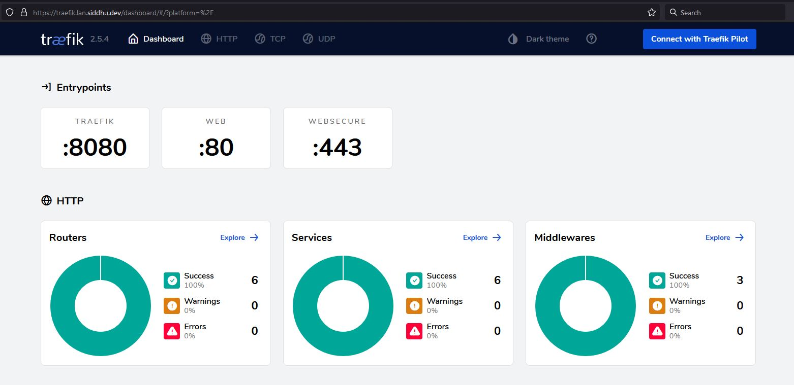

# The Traefik - Authelia Docker SSO Stack

# Navigation Structure
{: .no_toc }

## Table of contents
{: .no_toc .text-delta }

1. TOC
{:toc}

## What is Traefik?

The simplest, most comprehensive cloud-native stack to help enterprises manage their entire network across data centers, on-premises servers and public clouds all the way out to the edge.

[Traefik Official Website](https://traefik.io/)


## Why should I use it?

If you want to run several containers on a single server and have more than one of them respond to web traffic, you have to use a reverse proxy like Traefik.

# Basics

## Traefik Providers				

Traefik supports different types of providers to supply configuration to it. We are using [Docker provider](https://doc.traefik.io/traefik/providers/docker/) and [File provider](https://doc.traefik.io/traefik/providers/file/) here.

### Docker Provider 

It is used to configure our proxy through Docker labels.

### File Provider

Since Docker provider does not support proxying external URLs we are using the file provider.

## Prerequisite

 - A Machine with `docker` and `docker-compose` installed
 - Cloudflare account (Optional).
 - Portainer (Optional)
 - Running Home Assistant Docker stack
 - Lots of patience

## My setup

 - Raspberry Pi 4 - 4G running [DietPi](https://dietpi.com/)
 - WD Green 240 GB SSD Connected [Amazon](https://www.amazon.in/Western-Digital-WDS240G2G0A-240GB-Internal/dp/B076Y374ZH)
 - Orico Enclosure USB3.1 Gen 2 [Amazon](https://www.amazon.in/ORICO-External-Drive-Enclosure-Type-C/dp/B07RM4HLFH/) 
 - Connected via Ethernet

# Traefik Installation 

My storage location will be `/mnt/dietpi_userdata/traefik`

The domain I will be using is `lan.siddhu.dev`
## Get CloudFlare token

Login to CloudFlare

 - Click on the User Icon on the right top.
 - Navigate to `API Tokens`.
 - Click on `Vew` next to `Global API Key`.
 - Complete captcha if shown.
 - Copy the key to use with stack below.

## Create a dedicated network for connecting all containers and stacks

```shell
$ sudo docker network create --driver=bridge --attachable traefik-public
725626e1ece9d2b292a551c441140a94c23a24588860022998ebf83f9b403cf7
```

You can create a network in Portainer from `Networks -> Add Network`, Select Driver Bridge, and turn on `Enable manual container attachment`

## Create Traefik stack 

Important Notes:

 - The Traefik itself will be using `traefik.lan.siddhu.dev` domain .

 - Traefik requires you to define "Certificate Resolvers" in the configuration, which is responsible for retrieving certificates from an ACME server.

 - We will be using the resolver name `letsencrypt`, just a name you can use anything.

 - The configuration below is used to create a wildcard cert for all domains under `lan.siddhu.dev` since LetsEncrypt comes with [rate limits](https://letsencrypt.org/docs/rate-limits/) .

```
      - 'traefik.http.routers.traefik.tls.domains[0].main=lan.siddhu.dev'
      - 'traefik.http.routers.traefik.tls.domains[0].sans=*.lan.siddhu.dev'
```

- In Dynamic Configuration `local-ip` should be replaced with your Raspberry Pi / VM IP, this once is used for proxying all the devices running in the docker `host` network. All docker containers are configured through the Portainer itself.

### Create folders

`mkdir -p /mnt/dietpi_userdata/traefik/confs`

`nano /mnt/dietpi_userdata/traefik/confs/traefik.yml`

```
## traefik.yml

# Docker configuration backend
providers:
  docker:
    endpoint: "unix:///var/run/docker.sock"
    exposedByDefault: false
  file:
    directory: "/etc/traefik"
    watch: true

# API and dashboard configuration
api:
  insecure: true

entryPoints:
  web:
    address: ":80"
    http:
      redirections: # Force redirect to https 
        entryPoint:
          permanent: true
          to: websecure
          scheme: https
  websecure:
    address: ":443"

certificatesResolvers:
  letsencrypt:
    acme:
      #caServer: https://acme-staging-v02.api.letsencrypt.org/directory
      storage: /letsencrypt/acme.json
      email: your-email@gmail.com
      dnschallenge:
        provider: cloudflare

## DYNAMIC CONFIGURATION
http:
  routers:

    esphome:
      rule: "Host(`esphome.lan.siddhu.dev`)"
      service: esphome-service
      priority: 1000
      tls:
        certresolver: letsencrypt
      entryPoints:
        - websecure

    homeassistant:
      rule: "Host(`ha.lan.siddhu.dev`)"
      service: homeassistant-service
      priority: 1000
      tls:
        certresolver: letsencrypt
      entryPoints:
        - websecure

  services:

    esphome-service:
      loadBalancer:
        servers:
          - url: "http://local-ip:6052"

    homeassistant-service:
      loadBalancer:
        servers:
          - url: "http://local-ip:8123"

```

Create a new stack named `traefik` in portainer

```
version: "3.3"

services:

  traefik:
    image: "traefik:v2.5"
    container_name: "traefik"
    labels:
      - 'traefik.enable=true'
      - 'traefik.http.routers.traefik.rule=Host(`traefik.lan.siddhu.dev`)'
      - 'traefik.http.routers.traefik.entrypoints=websecure'
      - "traefik.http.routers.traefik.tls.certresolver=letsencrypt"
      - 'traefik.http.routers.traefik.tls=true'
      - 'traefik.http.routers.traefik.tls.domains[0].main=lan.siddhu.dev'
      - 'traefik.http.routers.traefik.tls.domains[0].sans=*.lan.siddhu.dev'
      - 'traefik.http.services.traefik.loadbalancer.server.port=8080'
      - "traefik.docker.network=traefik-public"
    environment:
      - "CF_API_EMAIL=your-email@gmail.com"
      - "CF_API_KEY=cloudflare-api-key-here"
    ports:
      - "80:80"
      - "443:443"
      - "8080:8080"
    volumes:
      - "/mnt/dietpi_userdata/traefik/letsencrypt:/letsencrypt" # used for storing certifcates and l3 related data
      - "/mnt/dietpi_userdata/traefik/confs:/etc/traefik" # file provider for Traefik
      - "/var/run/docker.sock:/var/run/docker.sock:ro"
    restart: unless-stopped
    networks:
      - traefik-public

networks:
  traefik-public:
    external: true
```

## Check with browser

Open the url traefik.lan.siddhu.dev in browser, it may throw SSL error for few minutes. If it happends try after 1 or 2 minutes.



If everything goes well procced to next step


## Creating a new Proxy with Traefik

Dozzle is a log viewer for docker containers. Let deploy one with SSL cert in Treafik

````
version: "3"
services:
  dozzle:
    container_name: dozzle
    image: amir20/dozzle:latest
    volumes:
      - /var/run/docker.sock:/var/run/docker.sock
    #ports:
     # - 9999:8080
    labels:
      - "traefik.enable=true"
      - "traefik.http.routers.dozzle.rule=Host(`dozzle.lan.siddhu.dev`)"
      - "traefik.http.routers.dozzle.entrypoints=websecure"
      - "traefik.http.routers.dozzle.tls.certresolver=letsencrypt"
      - "traefik.http.routers.dozzle.tls=true"
      - "traefik.http.routers.dozzle.middlewares=authelia@docker"
      - "traefik.http.services.dozzle.loadbalancer.server.port=8080"
      - "traefik.docker.network=traefik-public"
    restart: unless-stopped
    networks:
      - traefik-public
networks:
  traefik-public:
    external: true
````

Within a few seconds it will appear on Traefik dashboard and you can use it with the URL `dozzle.lan.siddhu.dev`

## For every New server you must add labels and networks in container

```
    labels:
      - "traefik.enable=true"
      - "traefik.http.routers.dozzle.rule=Host(`dozzle.lan.siddhu.dev`)"
      - "traefik.http.routers.dozzle.entrypoints=websecure"
      - "traefik.http.routers.dozzle.tls.certresolver=letsencrypt"
      - "traefik.http.routers.dozzle.tls=true"
      - "traefik.http.routers.dozzle.middlewares=authelia@docker"
      - "traefik.http.services.dozzle.loadbalancer.server.port=8080"
      - "traefik.docker.network=traefik-public"

    networks:
      - traefik-public
```

And network under service 

```
networks:
  traefik-public:
    external: true
```

## Adding authentication using Authelia

[Install Authelia](install-authelia.md)