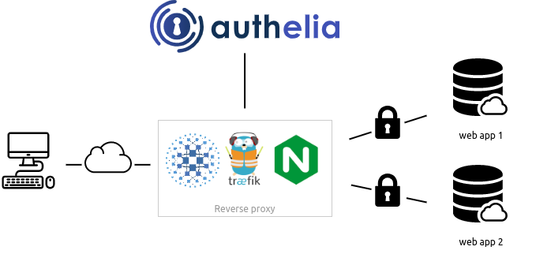

# The Traefik Docker ‘Stack’  

## What is Traefik?

The simplest, most comprehensive cloud-native stack to help enterprises manage their entire network across data centers, on-premises servers and public clouds all the way out to the edge.

[Traefik Officail Website](https://traefik.io/)

## What does it do  ?

Is acts as a proxy server between you applcationa and the browser. It adds a level of security with auto generated SSL serficates via lets encrypt

## What is Authelia

Authelia is an open source authentication and authorization server protecting modern web applications by collaborating with reverse proxies such as NGINX, Traefik and HAProxy. Consequently, no code is required to protect your apps.

## What does it do  ?

Enable your users to login once and access everything.

[Authelia Officail Website](https://www.authelia.com/)

# Basics

## Traefik Basics

Trafic supports different type of providers to supply configuration to it. We are using [Docker provider](https://doc.traefik.io/traefik/providers/docker/) and [File provider](https://doc.traefik.io/traefik/providers/file/) here.

### Docker Provider 

It is used to configure our proxy though Docker labels.

### File Provider

Since Docker provider doesnot support proxying external urls we are using file provider.

