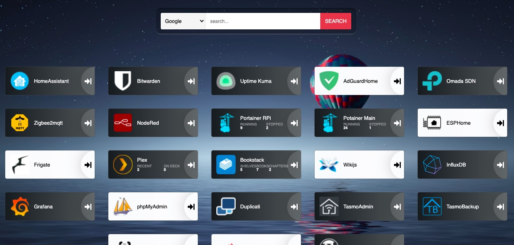

# How to add custom apps to Heimdall - The proper method

## What is Heimdall?

Heimdall is a self-hosted personal dashboard. It acts as a dashboard that hosts links to all your self-hosted, or online apps and app instances. See the screenshot bellow to get an idea.

## Why Do You Need This?

Heimdall comes preloaded with many foundation and enhanced apps. However, one may find that not all apps are there. Not to worry. There is a huge community supporting ongoing development of Heimdall, and some of them have been kind enough to make their own versions of apps, which are not available in Heimdall out of the box. We can easily make them available in Heimdall with a few lines of commands

***NOTE:** This guide is only applicable to the docker installation. You may adapt the steps in a normal installation too.*

The official installation offers many apps for the dashboard, but there are numerous more, developed by the community. These apps can be added by following this method.

[Heimdall Home Page](https://heimdall.site/)

For this guide, I will use the example of Omada SDN Controller.

First, go to [Heimdall App Request List](https://apps.heimdall.site/request/list) and check if the desired app is available in the page. 

***NOTE**: Only apps made avaiable in this page can be used with this method.*

## Steps

1. Locate the app and ownload the file; let's take the example of Omada. You will see two columns with names of *Foundation App* and *Enhanced App*.  Right click on the link, copy link, and use:

    ``wget https://apps.heimdall.site/request/enhanced/aeddfb31b642e8e30591a99b3b3c30b8a765be32``
    

2. Now, unzip the file.

    ``unzip OmadaSDNController.zip``

3. Transfer the file to docker-data path. In your case case, this is home/seetendra/docker_volumes/heimdall/config/www/SupportedApps - You can use a samba share or use terminal. In terminal, you can use the cp command. e.g., 

    ``sudo cp -r OmadaSDNController docker_volumes/heimdall/config/www/SupportedApps/OmadaSDNController``

    *This has to go to the docker path of Heimdall. In may case, it is stored in my Home Folder -> **docker_volumes** folder*
    

4. Once the folder is added to the supported apps folder in Heimdall, lets get inside the container. Either use Portainer to get inside the container, or use terminal to do so. E.g., 

    ``docker exec -it heimdall /bin/bash``

    *Alternatively, you can use Portainer to get inside the container*
    

5. And then do the following to change to the heimdall core directory inside docker:

    ``cd /var/www/localhost/heimdall/``
    
    

6. Next, we need to create a new folder. We need to use the folder name, exactly as the original file name. Here, it is ``OmadaSDNController``

    ``php artisan register:app OmadaSDNController``
    
    
    
7. That's about it. Now, you can head over to Heimdall and add this app from the drop down list. It should show up in the drop down.

