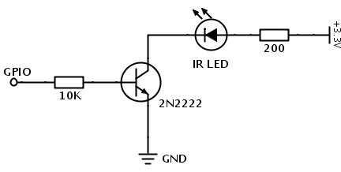

# Create your own IR blaster

## Why?
We still live in a world with a host of devices that use their own remotes. Creating an IR blaster allows you to make these devices smart and control them without picking up your remotes ever again. 

## Can I just buy one?
Buying one is easy and you have a few options
- Tuya convert supported IR blasters: https://www.amazon.in/gp/product/B07N4LSZF6/ref=ppx_yo_dt_b_search_asin_title?ie=UTF8&psc=1 
- Broadlink IR blasters

However, note that buying one is significantly more expensive than creating one, plus you can't use those nodes to do anything else. 

## Things to buy
- An ESP controller
- Strong IR LED - The general IR LEDs in the market don't have enough range to cover a normal room, buy special purpose Vishay LEDs to get an appropriate range. I tested these LEDs in a 6mX6m area and a single LED worked flawlessly to achieve the range: TSAL4400, 6200 and 6400, 7400. Do read their datasheets to know about their angles and power to decide what's best for you. 
  - TSAL4400 for example has a coverage area of 50 degrees so you can cover a pretty wide range. You can buy from: https://veerobot.com/tsal4400-high-power-ir-emitter?search=Tsal&description=true
  - You can possibly have multiple IR LEDs that are pointing in all directions but you really don't need them for most rooms if you use the above ones. **Important**: You should never place your LEDs close to each other since they can interfere and end up screwing the signal. Use the viewing angle from the datasheet to make a decision.  

## Circuit
The maximum current drawn from an ESP pin is of the order of 10mA. While you can drive an IR LED with this current, you are going to get the highest range only when you drive your LEDs with current of the order of ~100mA. 

You can easily use a transistor 2N2222 the IR LED (in series with a resistor). You can calculate the resistor value by using the voltage drop of the IR Led. eg If your IR LED has a voltage drop of 1.2V and your source voltage is 5V, then your resistor should have a voltage drop of 3.8V. You can then calculate the R value using the desired current. For 100mA, you would need a resistor of 38 ohm. 

## Software
I use ESPHome to encode all switches using the [IR component](https://esphome.io/components/remote_transmitter.html) but you can potentially use something more generic like [Tasmota IR blaster](https://tasmota.github.io/docs/IR-Remote/) 

## Optional - Add a receiver circuit
You can optionally add a receiver to be able to intercept signals from normal remotes so that your smart systems always know about the current state(when you turn on/off using the remote). 

This isn't really necessary(eg you never use the remote) but a good to have. Note that you can achieve the same using an IR receiever rather than a TSOP, but a TSOP is significantly less error prone and does filtering for you so no reason to not use one. Buy link: https://www.amazon.in/TSOP-1738-IR-RECEIVER-PCS/dp/B07B6QMZ4G

You can then add your receiver in ESPHome as well using the IR component: https://esphome.io/components/remote_receiver.html
