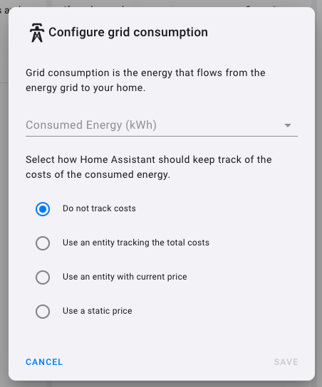

## What is this?
<br/>

This Do It Yourself system is designed to monitor power consumption (AC). You can use this to monitor your whole house energy consumption, or energy consumptoin in a localised area such as a specific room. 
<br/> 

## Why Do You Need This?
<br/>

Power monitoring has plenty of potential for numerous automations, ranging from powering down appliances, to monitoring and controlling energy usage habits. The only limit is your imagination. By integrating energy data to Home Assistant, you can also track your usage over time.
<br/>
 

## Components Needed
<br/>

- PZEM-004T - This sensor is factory calibrated and can measure up from 10A to 100A depending on your set-up. This doc is based on 100A measurement.
- Wemos D1 Mini/ ESP32
- 5V Power Supply (any HLK or a mobile charger)
<br/> 

## Preparing PZEM-004T
<br/>

You need to add a 1K resitor between the 5V and the RX Optocoupler. Referr to this page for more information and a detailed explanation: https://tasmota.github.io/docs/PZEM-0XX/#hardware-connections  
<br/>
 
An image for your reference:

## Schematic
<br/>
Two schematics are included. One for ESP8266 and the second one for ESP32. I recommend using ESP32 for better stability and Hardware UART Capabilities. 
<br/>
<br/>

**ESP8266**

<br/>

**ESP32 Version**

<br/>

**Reference Connection Diagram using D1 Mini**

<br/>

You can see that the configuration here connects 5V on the PZEM-004T to the 3V pin on the D1 mini. In short, we are supplying the PZEM-004T with 3.3V, for optimum operation.

 

## ESPHome Configuration
<br/>

We will be following the documentation followed by ESPHome: https://esphome.io/components/sensor/pzem004t.html
<br/>

In this case, **ESP32** configuration is presented as an example.
<br/>

```
uart:
  rx_pin: GPIO3
  tx_pin: GPIO1
  baud_rate: 9600

modbus:

sensor:
  - platform: pzemac
    current:
      name: "Electricty Current"
    voltage:
      name: "Electricty Voltage"
    energy:
      name: "Electricty Energy"
    power:
      name: "Electricty Power"
      id: w
    frequency:
      name: "Electricty Frequency"
    power_factor:
      name: "Electricty Power Factor"
    update_interval: 2s

  - platform: total_daily_energy # Converting energy from W to kwh
    name: "Electricty Energy kwh"
    power_id: w
    filters:
        # Multiplication factor from W to kW is 0.001
      - multiply: 0.001
    unit_of_measurement: kWh
    icon: mdi:counter
    accuracy_decimals: 3
```
<br/>

> :warning: **NOTE**: As absurd as it sounds, some PZEM-004T versions were observed to have their TX and RX switched, despite what it says on the sensor/board. So, if the RX/TX pin configuration is not working, try swapping these pins within the software (ESPHOME). e.g., you can set rx_pin to GPIO1, and tx_pin to GPIO3
<br/>

Bellow is an example for **ESP8266**.
<br/>

```
uart:
  tx_pin: D1
  rx_pin: D2
  baud_rate: 9600

modbus:

sensor:
  - platform: pzemac
    current:
      name: "Electricty Current"
    voltage:
      name: "Electricty Voltage"
    energy:
      name: "Electricty Energy"
    power:
      name: "Electricty Power"
      id: w
    frequency:
      name: "Electricty Frequency"
    power_factor:
      name: "Electricty Power Factor"
    update_interval: 2s

  - platform: total_daily_energy # Converting energy from W to kwh
    name: "Electricty Energy kwh"
    power_id: w
    filters:
        # Multiplication factor from W to kW is 0.001
      - multiply: 0.001
    unit_of_measurement: kWh
    icon: mdi:counter
    accuracy_decimals: 3
```
<br/>

Now, make sure it is connected and communicating with Home Assistant. 
<br/>

## Home Assistant Configuration for Energy
<br/>

As we are already convering energy in w to kwh within the ESPHome node, it is possible for us to directly bring this to Home Assistant, by using the ``utility_meter`` integration (https://www.home-assistant.io/integrations/utility_meter/)
<br/>
 
Example configuration entry in ``configuration.yaml``.
<br/>

```
utility_meter:
  electricity_daily_energy:
    source: sensor.electricity_energy_kwh
    cycle: daily
```

Save ``configuration.yaml``, and restart Home Assistant.
<br/>

We should be able to add this new entity to Home Assistant Energy Configuration. You can access energy configuration from ``Configuration`` -> ``Dashboards`` -> ``Energy``
<br/>

Under Electricity Grid, click on Add Consumption. Choose your entity, which is ``electricity_energy_kwh`` in this case.
<br/>



Click Save. 

> ❕ **NOTE**: It may take some time for the electricity_energy_kwh to popup in the energy configuration. 

> ❕ After adding the configuration, it may take up to 1-2 hours for energy data to pop up on the energy dash board. 
<br/>
 

If you would like to go deeper in this, there is a detailed discussion page - On Tasmota Github!

https://github.com/arendst/Tasmota/discussions/10567
<br/>

You can buy PZEM-004T from:
https://www.techtonics.in/peacefair-pzem-004t-ac-multi-function-electric-energy-metering-power-monitor
https://robu.in/product/pzem-004t-multi-function-ac-power-monitor-module/
Or try Banggood


