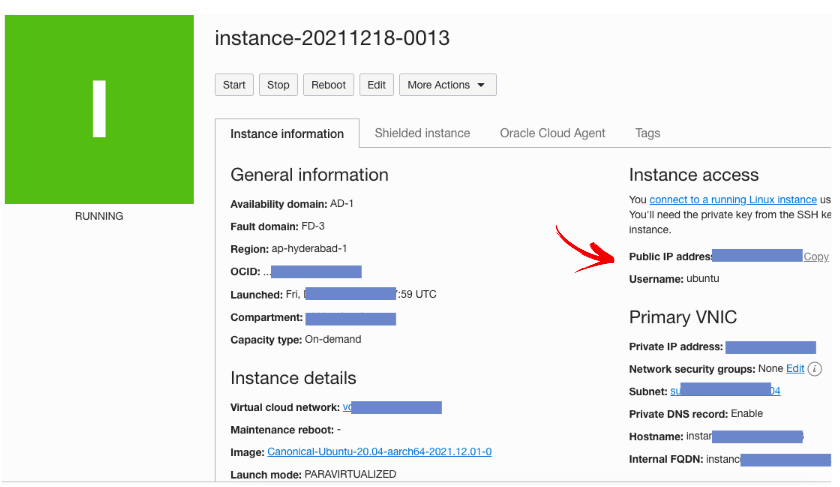

# Accessing Internal Apps through Oracle, Cloudflare and Tailscale with Your Domain

This doc describes how you can access your home network from outside, with the help of Oracle cloud instance, Tailscale, Nginx Proxy Manager and Cloudflare. This doc expects you to have a Domain name, which will be used for connecting from the internet. 


## 1. Why Do You Need it?

We always find in situations where we need to access locally hosted services online. More often than note, most of us are behind a double-nat, making it impossible to do so without opting for static IP from the ISP, which introduces us to a whole new lot of problems. This set-up, can help you run a tunnel from your local instance to an online instance, making it possible to access these services from the internet. 
<br/>

## 2. What Do You Need?

- A domain name - duh!
- An Oracle Always Free instance - Ampere
- Cloudflare
- Tailscale
- Docker
- Nginx Proxy Manager on Docker
- Maria DB on Docker
- Putty and Puttygen or Terminal
<br/>

## 3. Oracle Always Free Instance

Oracle offers always free services. 

- Click this link: https://www.oracle.com/in/cloud/free/
- Create an account, by clicking on Start for Free
- Sign-up, and verify your account. 
<br/>

### 3.1. Creating a New Instance

Click on the menu on the left-hand side top, and choose **Instances** under **Compute**
<br/>


<br/>

... and then, click on **Create Instance**
<br/>


<br/>

In the next page, you should select an appropriate image. Here, I am using Ubuntu as the image for the instance. Click **EDIT** on the right hand side, in the **Image and Shape** row, and then click on change, select Ubuntu Canonical, or whichever image you are comfortable with. 
<br/>


<br/>

You can also select which type of instance you need. You can have an x64 type AMD instance, or an Ampere instance. Ampere instances are ARM64 instance, which use processors similar to a raspberry pi; they also have more resources, including more ram. In this case, I am going to use the Ampere (AMR64) instance. 
<br/>


<br/>

Under this configuration, you can choose number of CPUs, and the amount of RAM. For Ampere, you can have a maximum of 4 CPUs, and 24GB of ram. Choose as you require.


> 💡 **TIP**: You can spread these resources across multiple instances. For example, you can have 2 instances covering 2 CPUs, and 12GB RAM each.


Now, scroll down; at add SSH Keys, you need to add a public key. This is required for managing the instance remotely, via SSH. Click **Paste public keys**, open Putty on your Desktop (Windows) and Generate keys. 
<br/>


<br/>

Copy the generated public key from the window and paste in the **SSH Keys** field
<br/>


<br/>

Now, we need to save the private key, so that we can log-in using this public-private key combination through ssh. If asked for proceeding without a password, press Yes.
<br/>


<br/>

Save this key securely. We will need this key whenever we need to ssh into this instance.

Now, click on **Create** and wait for Oracle to process and provision your instance.

> 💡 **Important things to note**: Once the instance is started and running, note down the public IP of the instance. We will need this to configure our domain access. 
<br/>


<br/>

Now, our Oracle Cloud is up and running. Test your SSH, by loading the key file to PUTTY, and key in the public IP address of the instance. Username is ubuntu and you won't need a password, if using a ssh key file. Check ssh connection, and make sure everything is working properly. 

> :grey_exclamation: **The following configurations assume that you are in an SSH connection with the Oracle Instance**

For the initial configuration, we need to update and upgrade the operating system, and do some housekeeping. We need to run the following commands, one by one.

``sudo apt update; sudo apt upgrade -y``

``sudo apt purge netfilter-persistent iptables-persistent``

``sudo snap remove oracle-cloud-agent``

``sudo apt purge snapd open-iscsi lxd lxcfs``

<br/>

### 3.2. Network Configuration

Once the instance is up and running, we need to set a few ingress rules to allow traffic come in to the Oracle instance by making some rules.

As a rule of thumb, if we are forwarding traffic to a specific port, we should make an ingress rule in here. As we would be following subdomains, we need to make rules for port 80, and 443. If you want allow access to specific ports, such as 5055, or 5013 for Traccar etc. you should add these ports too.

- On the instance page, click on Virtual Cloud network name, under **Instance details**. (1)
- On the next page, click on the subnet name again. (2)
- On the next page, click on default security list, under security lists (3)
<br/>


<br/>

On the next page, click on **Add Ingress Rules**, and use the following format for each port you would like to use. I would advise to use only port 80 and 443.
<br/>


<br/>

This concludes the networking part at the Oracle instance. 

<br/>
<br/>

### 3.3. Software Configuration

As mentioned earlier, in order to forward requests we need a number of software/applications running in the Oracle instance. Begin by installing Tailscale.
<br/>
<br/>

#### 3.3.1. Tailscale
You can follow these instructions from Tailscale itself. (https://tailscale.com/download/linux)

You can either use the one command installer, or the conventional method.

I used, the one command method: ``curl -fsSL https://tailscale.com/install.sh | sh``

Once installed, run ``sudo tailscale up`` - copy the URL displayed on the terminal and paste it in a browser. Login using your Tailscale details/or sign-up, if first time user.

Tailscale is now configured on your Oracle Instance. 

<br/>
<br/>

#### 3.3.2. Docker and Docker Compose

As all our services will be on Docker, we need to install docker and docker-compose.

To install Docker, follow the recommended approach of “Install using the repository” method on Docker page.

Or, follow the following procedure.

SSH into the instance, using the pem (ssh key) file as described above, and then…
<br/>

Single script method:

```
sudo apt-get update
sudo apt-get upgrade
curl -fsSL test.docker.com -o get-docker.sh && sh get-docker.sh
```

Verify if docker was installed successfully by checking: ``sudo docker --version`` - This should return the Docker version installed in the system. It should return something like this:

``Docker version 20.10.12, build e91ed57``

Now, add the current user to Docker groups

``sudo usermod -aG docker $USER``
<br/>
<br/>

To install **docker-compose**, copy and paste the following. We will be using the python method. 

- Step 1: Install pip first: ``sudo apt-get install python3-pip``
- Step 2: Install docker-compose: ``sudo python3 -m pip install -IU docker-compose``
<br/>

> :warning: **If you would like to uninstall docker-compose at some point, run** ``pip3 uninstall docker-compose``
<br/>

Check installation by ``docker-compose --version`` - it should return the current version of Docker Compose installed in the system.

If you are not able to see a version number or if it says docker-compose command not found, run ``pip3 uninstall docker-compose`` and then repeat Step 1 and 2 again. This should fix the problem.
<br/>
<br/>

#### 3.3.3. Install Docker Containers
<br/>

First, we need to create a new folder called docker-compose.yaml - ``sudo nano docker-compose.yaml``
<br/>
 
Add the following content into the file. 
<br/>

```
version: "3"
services:
  app:
    image: 'jc21/nginx-proxy-manager:latest'
    restart: unless-stopped
    container_name: npm
    ports:
      # Public HTTP Port:
      - '80:80'
      # Public HTTPS Port:
      - '443:443'
      # Admin Web Port:
      - '81:81'
      # Add any other Stream port you want to expose
      # - '21:21' # FTP
    environment:
      DB_MYSQL_HOST: "db"
      DB_MYSQL_PORT: 3306
      DB_MYSQL_USER: "npm"
      DB_MYSQL_PASSWORD: "npm"
      DB_MYSQL_NAME: "npm"
    volumes:
      - /home/ubuntu/nginx/data:/data
      - /home/ubuntu/nginx/letsencrypt:/etc/letsencrypt
    depends_on:
      - db
  db:
    image: 'jc21/mariadb-aria:latest'
    restart: unless-stopped
    container_name: mariadb
    environment:
      MYSQL_ROOT_PASSWORD: 'npm'
      MYSQL_DATABASE: 'npm'
      MYSQL_USER: 'npm'
      MYSQL_PASSWORD: 'npm'
    volumes:
      - /home/ubuntu/nginx/mysql:/var/lib/mysql
```
<br/>

Once done, press *CTRL+X* on keyboard, and then type *Y*. Press Enter. 

Once done, type ``sudo docker-compose up -d`` and press enter

If everything goes well, you will now have Nginx Proxy Manager and its backend DB installed on your Oracle instance.
<br/>
<br/>

## 4. Local Configurations

> :bulb: **TIP:** The following instructions are to be implemented on your local machine, running Home Assistant, or other internal applications. 

The current strategy is to create a tunnel between our local instance and online instance, so that we can access our local instance remotely. For that, we need to have Tailscale installed on our local server too. You can either choose to install this through a direct instal, like how we did above, or instal Tailscale as a docker service. 
<br/>
<br/>

### 4.1. Tailscale
<br/>

You can either install Tailscale as normally, within the system, or follow the Docker method.
<br/>
<br/>

#### 4.1.1. Tailscale - Normal Installation

You can follow these instructions from Tailscale itself. (https://tailscale.com/download/linux)

You can either use the one command installer, or the conventional method.

I used, the one command method: ``curl -fsSL https://tailscale.com/install.sh | sh``

Once installed, run ``sudo tailscale up`` - copy the URL displayed on the terminal and paste it in a browser. Login using your Tailscale details/or sign-up, if first time user.

Tailscale is now configured on your Oracle Instance. 
<br/>
<br/>

#### 4.1.2. Tailscale - Docker Installation


Using Docker-compose, the following configuration can be used. If you do not have Docker and Docker Compose installed and configured, please follow the above sections for more details. 
<br/>

```
  tailscale:
      hostname: localservertailscale              # This will become the tailscale device name
      image: richnorth/tailscale:v0.99.1
      volumes:
          - "./tailscale_var_lib:/var/lib"        # State data will be stored in this directory
          - "/dev/net/tun:/dev/net/tun"           # Required for tailscale to work
      cap_add:                                    # Required for tailscale to work
        - net_admin
        - sys_module
      command: tailscaled
      network_mode: host
      restart: unless-stopped
```
<br/>

Run ``docker-compose up -d``

Once installed, configure the IP and login. 

``docker-compose exec tailscale tailscale up``

You will be asked to authenticate by visiting a link.


### 4.2. Home Assistant Configuration

We need to tell Home Assistant that our proxy is trying to connect to the local instance, and it needs to be whitelisted. Use the following configuration in Home Assistant ``configuration.yaml`` file. Change ``your_oracle_tailscale_ip`` as per your **Tailscale IP address**.

```
http:
  use_x_forwarded_for: true
  trusted_proxies:
    - your_oracle_tailscale_ip
```

That should be enough for local configurations. 
<br/>
<br/>

## 5. Domain Configuration 
<br/>

- We need to add a domain. 
- We need to point the domain to Cloudflare to hide our public IP
- We need to point Cloudflare to our Oracle Instance's public IP.

**I Assume that...**
- I assume that you have a domain name - e.g., myname.com.
- You need to create a free account in Cloud Flare. Go to https://dash.cloudflare.com/, Sign-Up for a new account.
- Create a new site, and choose the FREE option
- Now, on the domain page (of your domain registrar for myname.com - e.g., GoDaddy/Namecheap), change 
- DNS in step 3 in the domain registrar needs to be replaced with the DNS given in step 4. 
<br/>


<br/>

Once the DNS is changed in the domain registrar, you may have to wait for some time to reflect these changes.

Once this part is completed, you will see a message as following, on the Cloudflare page.
<br/>


<br/>

On Cloudflare, go to the DNS part in the left. Click on it. And in the A Type field, change the content to your public IP on the Oracle Instance, and hit save.
<br/>


<br/>

This should direct all your domain name requests for mydomain.com to the Oracle instance. 

## 6. Creating Redirections
<br/>


### 6.1. Cloudflare Configurations

First thing we need to do is create redirections in the form of subdomains. Visit dash.cloudflare.com

Select your domain, and choose DNS from the left sidebar menu. Then, click on add new record.


In type dropdown, choose CNAME, and in the Name field, enter the subdomain you would like. Here I am using ha. In the Target field simply put @ and turn-off proxy status for now. We enable this afterwards. Click save.
<br/>


<br/>

> ❕ **You should do this for all subdomains you would like to redirect**
<br/>
<br/>

### 6.2. Configure Nginx Proxy Manager - NPM
A very important step in this document is how to access your local services from the outside, using a domain name. For example, in this case, I will be using ha.mydomain.com to access my home assistant installation at home. When I enter this domain into the browser, something happens.
<br/>

``ha.mydomain.com`` -> ``cloudflare`` -> ``Oracle Instance`` -> ``NPM`` -> ``Oracle Tailscale`` -> ``Local Tailscale``
<br/>

In other words, a domain request gets redirected through Tailscale VPN to our local instance. The complex heavy lifting is done by NPM and Tailscale.

Install Tailscale on your local computer - this is the safest way to do it, every time you want to configure something.

Now using the Oracle Tailscale IP:PORT combination, access NPM. You can get your Oracle Tailscale IP by visiting the Tailscale admin page, or within computer application. For example, in a Mac, you can access this information by clicking on Tailscale tray icon.
<br/>


<br/>

For example, here, I would use my tailscaleip:port combination, such as xxx.xxx.xx.xx:81 to access NPM. 


The default access configuration as follows:

```
Email:    admin@example.com
Password: changeme
```

On your first log-in, you will be prompted to change user email, and password. Do so.

On NPM home page, click on **Proxy Hosts**
<br/>


<br/>

Click on Add Proxy Host in the next page

Use your desires sub-domains, such as those we have created in Cloudflare.


> :warning: Always create a subdomain first, in Cloudflare, disable proxy for the time being, and then create an entry in the NPM, to avoid errors in proxy creation.
<br/>

- In Domain Names: Add the **desired subdomain** Here, ha.mydomain.com
- Scheme: **http**
- Forward Hostname / IP: Your **local server Tailscale IP**
- Forward Port: Your local server port - here **8123** for **Home Assistant**
- Check: **Cache Assets, Block Common Exploits, and Websockets Support**
- Then move to the third Tab SSL
- Click in SSL Certificate field, and select **Request New SSL Certificate**
- Check **Force SSL, HTTP/2 Support, and HTTS Enabled**
- Check Agree to the terms, and Click Save
<br/>


<br/>

When you click on save, a new proxy will be created along with a Let’s Encrypt SSL Certificate.

> :warning: **If you try to enter a subdomain that is not configured in Cloudflare, this step will fail**

Once done, check if your subdomain is working. For example, if all steps were followed correctly, ha.mydomain.com should take you to your local Home Assistant installation.
<br/>
<br/>

> ❕ After verifying the proxy is operational, go back to Cloudflare, and Enable Proxy for the subdomain
<br/>

Test again, if everything is working as intended.

This completes the set-up
<br/>

Repeat Steps in **Creating Redirections** for each domain. 

You can now access your locally run services from the Internet by entering the configured subdomains. 

